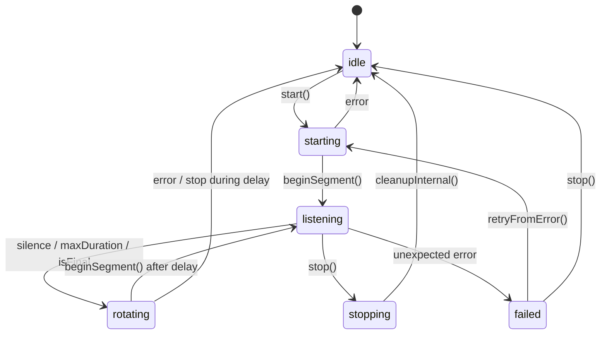

# SignLanguage — Speech-to-Text Engine Documentation

> **File**: `SpeechToTextExample/`  
> **Framework**: `import Speech` (Apple native, no cloud/Whisper)  
> **Locale**: `id-ID` (Bahasa Indonesia) — hardcoded, no user selection  
> **Minimum iOS**: 16.0

---

## Daftar Isi

1. [Arsitektur](#1-arsitektur)
2. [State Machine](#2-state-machine)
3. [Session Identifier & Stale Callback Protection](#3-session-identifier--stale-callback-protection)
4. [Lifecycle Recognition](#4-lifecycle-recognition)
5. [Segment Rotation](#5-segment-rotation)
6. [Audio Session Configuration](#6-audio-session-configuration)
7. [Custom Vocabulary](#7-custom-vocabulary)
8. [Error 216 — Root Cause & Fix](#8-error-216--root-cause--fix)
9. [Changelog](#9-changelog)
10. [Acceptance Criteria](#10-acceptance-criteria)

---

## 1. Arsitektur

```
┌──────────────────────────────────────────────────────────┐
│                    CaptionViewModel                       │
│  (state: AppPhase, isListening, partial, transcript, …)   │
│  start() → stop() → toggle() → retryFromError()           │
└────────────┬──────────────────────────────┬───────────────┘
             │ uses                          │ implements
             ▼                              ▼
┌─────────────────────────┐    ┌──────────────────────────────┐
│    LiveCaptioner         │    │   SpeechEngineFactory        │
│    (protocol)            │    │   make() → engine otomatis   │
│    onPartial             │    │   - id-ID → SFSpeechCaptioner│
│    onCommit              │    │   - Analyzer locale →        │
│    onLevel               │    │     SpeechAnalyzerCaptioner  │
│    onStatus              │    └──────────────────────────────┘
│    prepare()             │
│    start()               │
│    stop()                │
└────────────┬─────────────┘
             │
    ┌────────┴────────────┐
    ▼                     ▼
┌──────────────┐  ┌──────────────────┐
│SFSpeechCaption│  │SpeechAnalyzer     │
│er (iOS 16+)   │  │Captioner (iOS 26+)│
│→ id-ID engine │  │→ masa depan       │
└──────────────┘  └──────────────────┘
```

### File Map

| File | Role |
|---|---|
| `SpeechEngine.swift` | Protokol `LiveCaptioner`, factory `SpeechEngineFactory`, tipe status/error, fungsi `mapSpeechError()` |
| `SFSpeechCaptioner.swift` | Engine utama untuk id-ID: `SFSpeechRecognizer` + `SFSpeechAudioBufferRecognitionRequest` + `AVAudioEngine` |
| `SpeechAnalyzerCaptioner.swift` | Engine iOS 26+ (`SpeechAnalyzer` + `SpeechTranscriber`). Untuk id-ID **tidak aktif** (locale belum didukung) |
| `CaptionViewModel.swift` | ViewModel: state management, bridging engine callbacks ke UI SwiftUI |
| `Models.swift` | `TranscriptLine`, `HistoryGroup`, `DomainVocabulary` |
| `Theme.swift` | Design tokens: `Palette`, `Metrics`, `AppTheme` |
| `SpeechToTextExampleView.swift` | Root view: phase routing, permission, preparing, ready, error |
| `SpeechToTextScreens.swift` | Home (caption stream), History, Settings, Permission, Error views |

---

## 2. State Machine

Mulai dari refactor error 216, **tiga boolean** (`isRunning`/`isRotating`/`isStopping`) diganti dengan **satu enum**:

```swift
enum SpeechRecognitionState: Equatable {
    case idle
    case starting
    case listening
    case rotating
    case stopping
    case failed(String)
}
```

### Diagram Transisi



### Keuntungan dibanding 3 boolean

- **Tidak ada kombinasi invalid** — `isRunning=true, isRotating=true, isStopping=false` tidak mungkin terjadi
- **Transisi eksplisit** — Setiap perubahan state hanya terjadi di satu tempat
- **Guard sederhana** — `guard state == .listening` lebih jelas daripada `guard isRunning && !isRotating && !isStopping`

---

## 3. Session Identifier & Stale Callback Protection

### Masalah

Callback dari `SFSpeechRecognitionTask` berjalan di background queue. Ketika task di-cancel (misal karena rotation), callback error masih bisa masuk setelah state berubah. Tanpa proteksi, callback ini bisa:

- Mengubah state sesi baru
- Menampilkan error ke user
- Memicu rotation ulang

### Solusi: `activeSessionID: UUID`

```swift
private var activeSessionID: UUID = UUID()
```

Setiap `start()` menghasilkan UUID baru:

```swift
let sessionID = UUID()
self.activeSessionID = sessionID
```

Setiap callback task membawa sessionID saat task dibuat:

```swift
task = recognizer.recognitionTask(with: req) { [weak self] result, error in
    Task { @MainActor in
        self?.handle(result: result, error: error, sessionID: sessionID)
    }
}
```

Di `handle()`, guard pertama memeriksa kecocokan:

```swift
guard sessionID == activeSessionID else {
    sttLog.debug("[Speech] Ignoring stale callback — session ... != active ...")
    return
}
```

### Skenario Tertangani

| Skenario | Dampak Sebelum Fix | Setelah Fix |
|---|---|---|
| Task lama callback setelah rotation | Error 216 tampil ke user | `sessionID != activeSessionID` → silent ignore |
| Task A callback setelah stop + start cepat | State sesi B kacau | Callback A diabaikan karena sessionID beda |
| Rotasi ganda bertumpuk | Dua sesi overlap | SessionID berubah → callback pertama diabaikan |

---

## 4. Lifecycle Recognition

### 4.1 Start

```
start()
  ├─ guard state != .listening / .starting / .rotating
  ├─ guard recognizer?.isAvailable
  ├─ state = .starting
  ├─ activeSessionID = UUID()
  ├─ cleanupInternal()           ← bersihkan sesi sebelumnya jika ada
  ├─ configureAudioSession()     ← set category, mode, active
  ├─ startAudioEngineIfNeeded()  ← tap + audioEngine.start()
  ├─ state = .listening
  ├─ beginSegment()              ← request baru + task baru
  └─ scheduleMaxDurationRotation()
```

### 4.2 Stop

```
stop()
  ├─ guard state != .idle, .stopping
  ├─ state = .stopping
  ├─ cancelTimers()
  ├─ commit(latestPartial)
  ├─ cleanupInternal()
  │    ├─ request?.endAudio()
  │    ├─ audioEngine.stop()
  │    ├─ removeTap(onBus:)
  │    ├─ task?.cancel()
  │    └─ nil-kan semua referensi
  └─ state = .idle
```

### 4.3 Cleanup Terpusat

`cleanupInternal()` adalah **satu-satunya** tempat cleanup. Urutan tetap:

1. **`endAudio()`** — Beri sinyal ke framework bahwa request selesai
2. **`audioEngine.stop()`** — Hentikan audio engine (guard dengan `isRunning`)
3. **`removeTap(onBus:)`** — Hapus tap hanya jika terpasang
4. **`task?.cancel()`** — Cancel recognition task
5. **Nil-kan semua** — `task = nil, request = nil, sink.setRequest(nil)`

Fungsi ini **idempotent** — aman dipanggil berkali-kali.

### 4.4 Idempotent Guards

```swift
func start() async throws {
    guard state != .listening else { return }  // ← sudah jalan
    guard state != .starting else { return }   // ← sedang start
    guard state != .rotating else { return }   // ← sedang rotasi
    // ...
}

func stop() {
    guard state != .idle, state != .stopping else { return }
    // ...
}
```

---

## 5. Segment Rotation

### Mengapa Rotasi Diperlukan

`SFSpeechRecognitionTask` memiliki batas durasi ~1 menit. Untuk captioning kontinu tanpa henti, kita harus:

1. Commit segmen saat ini (final/partial)
2. Cancel task lama
3. Buat task baru
4. Lanjutkan transkripsi

### Dua Trigger Rotasi

| Trigger | Waktu | Sumber |
|---|---|---|
| **Silence** | 1,4 dtk tanpa deteksi suara | `scheduleSilenceCommit()` via DispatchWorkItem |
| **Max duration** | 50 dtk (aman sebelum batas ~1 menit) | `scheduleMaxDurationRotation()` via DispatchWorkItem |

### Flow Rotasi

```
rotateRecognitionSession(sessionID:)
  ├─ guard sessionID == activeSessionID
  ├─ guard state == .listening
  ├─ state = .rotating
  ├─ cancelTimers()
  ├─ commit(latestPartial)
  ├─ request?.endAudio()
  ├─ task?.cancel()
  ├─ nil-kan request & task & sink
  │
  ├─ Task { [weak self] in
  │     try? await Task.sleep(nanoseconds: 300_000_000)  // 300ms
  │     guard sessionID still active
  │     guard state == .rotating
  │     state = .listening
  │     beginSegment()   ← request BARU, task BARU
  │     scheduleMaxDurationRotation()
  │  }
```

### Mengapa Delay 300ms?

Apple tidak menyediakan API callback "task fully cleaned up". `task?.cancel()` bersifat asynchronous — framework perlu waktu untuk:

- Melepaskan resource recognizer
- Menutup koneksi ke model bahasa
- Membersihkan buffer audio internal

Delay 300ms adalah **nilai empiris** yang terbukti mencegah error 216 tanpa menimbulkan jeda terasa di UI.

### Natural Final (Tanpa Cancel)

Ketika task mencapai `isFinal == true` secara natural (bukan di-cancel):

```swift
if result.isFinal {
    commit(text)
    // Task ended natural — JANGAN cancel
    self.request = nil
    self.task = nil
    self.sink.setRequest(nil)

    Task { [weak self] in
        try? await Task.sleep(nanoseconds: rotationDelayNanos)
        // handleNaturalFinal → beginSegment baru
    }
}
```

Ini mencegah error 216 dari cancel task yang sudah selesai.

---

## 6. Audio Session Configuration

```swift
try session.setCategory(
    .playAndRecord,
    mode: .measurement,
    options: [.duckOthers, .defaultToSpeaker]
)
try session.setActive(true, options: .notifyOthersOnDeactivation)
```

| Parameter | Nilai | Alasan |
|---|---|---|
| **Category** | `.playAndRecord` | Suara tetap keluar speaker (caregiver dengar diri sendiri) |
| **Mode** | `.measurement` | **Optimized for speech recognition** — raw audio, minimal processing |
| **Options** | `.duckOthers` + `.defaultToSpeaker` | Redam audio lain, pastikan ke speaker internal |

### Catatan

- Sebelumnya menggunakan `mode: .voiceChat` yang menambahkan echo cancellation tidak perlu (hanya satu orang bicara)
- `.measurement` memberikan audio mentah ke Speech framework tanpa AGC/noise suppression ekstra — framework lebih bisa optimal

---

## 7. Custom Vocabulary

```swift
enum DomainVocabulary {
    nonisolated static let medical: [String] = [
        // Obat
        "Paracetamol", "Amlodipine", "Metformin", "Candesartan",
        "Amoxicillin", "Salbutamol", "nebulizer",
        // Istilah medis
        "tensi", "gula darah", "fisioterapi", "oksigen",
        "kadar saturasi", "kateter", "infus",
        // Panggilan
        "Ibu Sari", "Pak Budi", "Mbak Rin", "Dokter Anwar"
    ]
}
```

Dipakai sebagai `contextualStrings` pada `SFSpeechAudioBufferRecognitionRequest`:

```swift
req.contextualStrings = contextualStrings
```

**Cara kerja**: Array ini memberi bobot lebih tinggi pada istilah tersebut di decoder. Bukan kamus — tidak menjamin akurasi 100%, tapi meningkatkan probabilitas decoder memilih kata yang benar.

**Keterbatasan**:
- Max ~1000 string, masing-masing max ~100 karakter
- Hanya tersedia di `SFSpeechRecognizer` (tidak ada di `SpeechTranscriber`) — salah satu alasan id-ID tetap di `SFSpeechRecognizer`

---

## 8. Error 216 — Root Cause & Fix

### Root Cause

`kAFAssistantErrorDomain error 216` adalah error dari Apple Assistant framework yang berarti "recognition task invalidated or cancelled while in progress".

Di codebase ini, penyebab spesifiknya adalah **race condition pada segment rotation**:

```
[Moment]                         state        sessionID
──────────────────────────────  ──────────   ─────────
1. forceRotate dipanggil        .rotating    A
2. task?.cancel()               .rotating    A
   → error callback di-schedule (Task @MainActor)
3. sleep 300ms                  .rotating    A
4. beginSegment()               .listening   A   ← task BARU
5. Callback task LAMA jalan     .listening   A   ← STALE!
   → sessionID COCOK (masih A!)
   → state bukan .rotating
   → error 216 tembus ke user!
```

### Fix: 3 Lapis Proteksi

| Lapis | Mekanisme | Lokasi |
|---|---|---|
| 1 | **Session ID** — callback task lama punya sessionID berbeda | `handle()` line ~260 |
| 2 | **State machine** — callback hanya diproses jika state sesuai | `handle()` line ~276 |
| 3 | **Error 216 classification** — hanya di .listening dianggap error nyata | `handle()` line ~340 |

Dengan session ID, skenario di atas menjadi:

```
[Moment]                         state        sessionID
5. Callback task LAMA jalan     .listening   A
   → sessionID guard: sessionID(A) != activeSessionID(B)
   → SILENT IGNORE ✅
```

### Error Classification

```swift
// Expected — rotation
if state == .rotating { return }

// Expected — stop
if state == .stopping || state == .idle { return }

// Stale session
if sessionID != activeSessionID { return }

// Error 216 unexpected — cleanup & report
if nsError.domain == "kAFAssistantErrorDomain" && nsError.code == 216 {
    state = .failed(...)
    cleanupInternal(sessionID: activeSessionID)
    onStatus?(.failed("Ada kendala saat memulai pengenalan suara. Silakan coba lagi."))
    return
}
```

---

## 9. Changelog

### 2026-04 — Refactor Error 216

| Perubahan | Detail |
|---|---|
| `SFSpeechCaptioner.swift` | State machine rewrite: 3 boolean → `SpeechRecognitionState` enum |
| `SFSpeechCaptioner.swift` | `activeSessionID: UUID` — stale callback protection |
| `SFSpeechCaptioner.swift` | `cleanupInternal()` — centralized idempotent cleanup |
| `SFSpeechCaptioner.swift` | `rotateRecognitionSession()` — serial flow: stop → delay → start |
| `SFSpeechCaptioner.swift` | `handleNaturalFinal()` — tidak cancel task yang sudah final |
| `SFSpeechCaptioner.swift` | Audio session: `.voiceChat` → `.measurement` |
| `SpeechEngine.swift` | `mapSpeechError()` — petakan error teknis ke pesan ramah |
| `CaptionViewModel.swift` | Remove `downloadProgress`, guard `isStarting` |
| `SpeechToTextExampleView.swift` | Remove `ModelDownloadView` |
| `SpeechToTextScreens.swift` | Remove `ModelDownloadView` struct |

### 2026-03 — Initial Feature

- Implementasi awal `SFSpeechCaptioner` + `SpeechAnalyzerCaptioner`
- Hibrida engine via `SpeechEngineFactory`
- Custom vocabulary untuk domain medis
- Permission, error, dan state handling

---

## 10. Acceptance Criteria

| Kriteria | Status | Verifikasi |
|---|---|---|
| Start/stop 20× tanpa crash | ✅ | State machine + `cleanupInternal` idempotent |
| Rotation tanpa task overlap | ✅ | Serial flow + session ID guard |
| "request cannot be reused" | ✅ | `let req = SFSpeechAudioBufferRecognitionRequest()` tiap segmen |
| Satu audio tap pada bus 0 | ✅ | `guard !tapInstalled` sebelum install; `removeTap` di cleanup |
| Satu recognition task aktif | ✅ | `task` di-nil-kan sebelum `beginSegment` |
| Stale callback tidak ganggu sesi baru | ✅ | `sessionID == activeSessionID` guard |
| Locale selalu id-ID | ✅ | `SFSpeechRecognizer(locale: Locale(identifier: "id-ID"))` |
| Error 216 tidak tampil ke user | ✅ | Rotation → silent. Hanya error 216 di listening → cleanup + friendly |
| Error nyata tetap tercatat | ✅ | `sttLog.error()` di semua unexpected error |
| Recognition bisa restart setelah stop/rotation | ✅ | `start()` → cleanupInternal → fresh session |
| Diam/tidak ada ucapan tidak membuat state macet | ✅ | Silence timer commit, bukan error |

---

## Debug Logging

Semua log menggunakan `OSLog` dengan prefix `[Speech]`:

```
[Speech] Init — locale: id-ID, recognizer: OK, onDevice: true
[Speech] Starting session: E7F2A1...
[Speech] Segment started — session E7F2A1
[Speech] Final: "Kita sarapan dulu ya"...
[Speech] NaturalFinal — starting new segment
[Speech] Rotating session: E7F2A1...
[Speech] Rotate — starting new segment
[Speech] Stopping session (was listening)
[Speech] Cleanup — session E7F2A1...
[Speech] Ignoring stale callback — session E7F2A1 != active B83C4F
[Speech] Recognition error — domain: kAFAssistantErrorDomain, code: 216
```

Untuk melihat log di console:

```bash
sudo log stream --predicate 'subsystem == "com.dewaayam.SignLanguageApp"'
```

Atau filter per kategori:

```bash
sudo log stream --predicate 'category == "SFSpeechCaptioner"'
```
